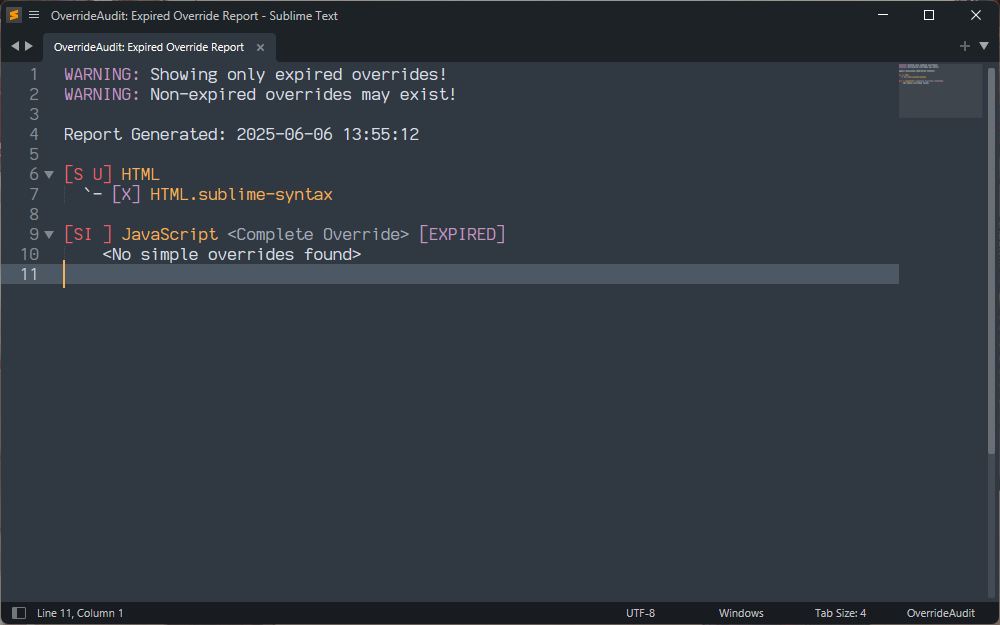

The Override Report is the main reason for using OverrideAudit. With it you can
get a quick overview of all of the package overrides you currently have, sorted
out by the package that they are contained in.

There are three versions of this report, one which shows you all overrides that
exist, one which shows you all overrides that are actually modifying the
underlying file, and a third that shows you only those overrides
[which have expired](../terminology/index.md#expired-override). This third
version is the report that will automatically get generated in certain
circumstances. See below for more information.

## Creating an Override Report

Create an Override Report by selecting the
`Tools > OverrideAudit > Override Report` menu item or by selecting
[OverrideAudit: Override Report](../usage/commands.md#override-report) from the
command palette.

There are three versions of this command, allowing you to create either an
Override Report that shows all overrides that exist (the default),a version
that shows you only those overrides which have expired, and a version that
only shows you overrides that are actually different from their underlying
files.

  <figure markdown="span">
    
  </figure>
  <figure markdown="span">
    
  </figure>

## Report Contents

The Override Report consists of a list of packages which contain overrides.
Each package in the report is followed by a list of all of the
[simple overrides](../terminology/index.md#simple-override) that currently exist
for that package, if any.

Packages in this report are marked up similarly to how they appear in the
[Package Report](package.md); they contain a compressed version of the package
state headers (`[S]`,`[I]`, `[U]`) and their names may be wrapped in `[square]`
or `<angle>` brackets to denote their status of being ignored or dependencies.

!!! NOTE

    As of Package Control 4, many package dependencies are installed as actual
    libraries rather than as special dependency packages. As such, you may not
    see all or even any dependencies in the report.

In addition, packages which are
[complete overrides](../terminology/index.md#complete-override) are also marked
with additional text to indicate this to you. This is a reminder and displayed
for any package which is both `[S]`hipped and `[I]`nstalled at the same time.
The `JavaScript` and `Python` packages in the above screen shots are an example
of such packages.

Any items which are expired are marked with additional text to call attention
to this fact. Expired overrides are prefixed with a marker to indicate that
they are e`[X]`pired, while an expired complete override has its package name
suffixed with the text `[EXPIRED]`. In the images above, the complete override
on the `JavaScript` package and the `HTML.sublime-syntax` override file are
examples of expired overrides.

When the
[ignore_unknown_overrides](../config/settings.md#ignore_unknown_overrides)
setting is turned on (it is enabled by default) the Override report will also
show [unknown overrides](../terminology/index.md#unknown-override) in the report
prefixed with a `[?]` marker to call your attention to such files.

The [Ignore Unchanged](../usage/commands.md#override-report-exclude-unchanged)
version of this report is as above, but for each override a comparison is done
between the override contents and the underlying file; if they are the same,
they are skipped from the report, so that you only see those overrides that are
changing something. This is a convenience for package authors who might be
altering the content of release packages.

The [Expired Only](../usage/commands.md#override-report-only-expired) version of
this report, as its name suggests, shows only those packages that contain
expired overrides, and similarly shows only the expired overrides, ignoring all
others. This allows you to focus your attention on only those overrides whose
original files may have been modified in a way that makes your override
invalid.

!!! NOTE

    An Expired Only Override Report is created automatically by OverrideAudit
    whenever Sublime Text starts and the version number is different than it
    was on the last run (i.e. Sublime has been updated).

    Additionally, the
    [report_on_unignore](../config/settings.md#report_on_unignore) setting
    (which defaults to `true`) also causes this report to be generated in cases
    where a package is removed from the list of ignored packages, such as when
    it has just been upgraded.

    In both cases, the report will not appear unless there is actually at least
    one expired override to report, so as not to get in your way.
